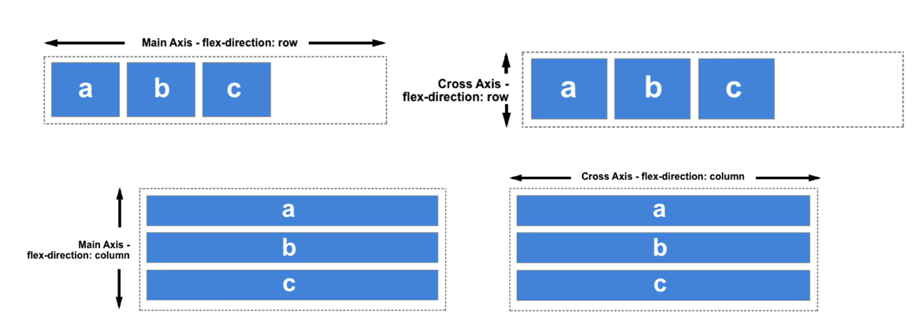
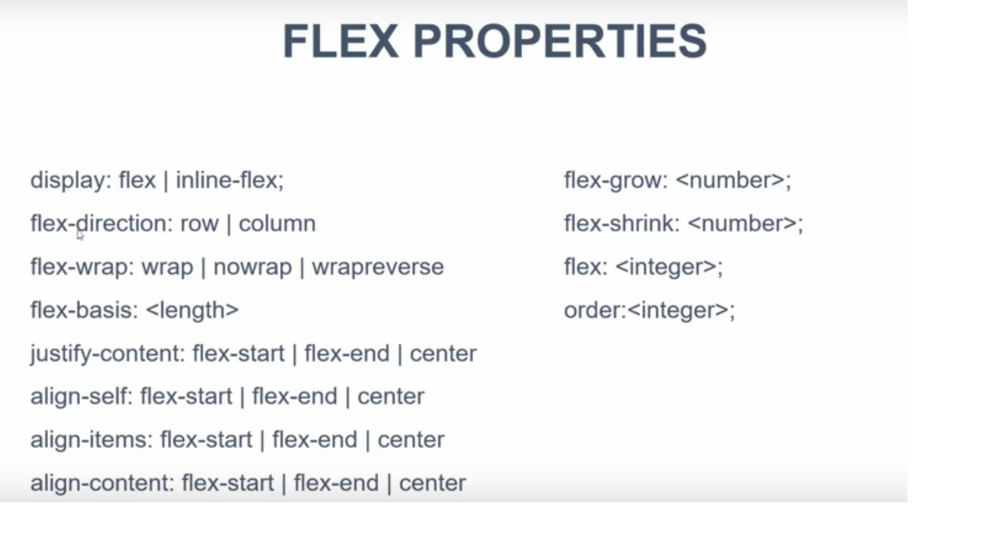
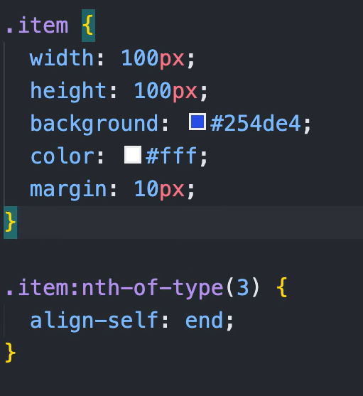

# Flex Box
- [Original Video](https://www.youtube.com/watch?v=JJSoEo8JSnc)
- [Updated Video](https://www.youtube.com/watch?v=3YW65K6LcIA&t=0s)
- Highly recommend using the second updated video.


**Additional video**


**What is flexbox** 
- Full name - flexible box model
- It's a method to display contents within a portion of a website. 
- Old way of doing things before Flexbox, the block model was used to assign where elements 

**FlexBox benefits**
- mobile friendly
- flex container margins don't collapse with margin of its contents
- Order of elements can be changed without editing HTML

# Flexbox model concepts
 - built for small scale layouts (see grids for large scale layouts)
 - direction agnostic (can work for displaying vertically and horizontally)



- `display = flex` for main container specifies the main container is a flexbox
- main axis = x axis
- cross axis = y axis
- every child item is a flex item
- notice how main changes depending on the direction

# Properties




- `display : flex / inline-flex`
    - Goes on container element

- Flex direction is specified along row column
- wrap will adjust content if screen made smaller
- `align-items`
    - layout for flex-items for **cross** axis
- `align-content`
    - layout for items for **cross** axis
    - possible mistake in video, one is likely different

- Order can change elements using only css

# Example from original video

## HTML Code
```
<div class="container-1">
  <div class="box-1">
    <h3>Box One</h3>
    <p>A</p>
  </div>
  <div class="box-2">
    <h3>Box Two</h3>
    <p>B</p>
  </div>
  <div class="box-3">
    <h3>Box Three</h3>
    <p>C</p>
  </div>
</div>
  
<div class="container-2">
  <div class="container-2-box">
    <h3>Box Four</h3>
    <p>D </p>
  </div>
  <div class="container-2-box">
    <h3>Box Five</h3>
    <p>E</p>
  </div>
  <div class="container-2-box">
    <h3>Box Six</h3>
    <p>F</p>
  </div>
</div>

<div class="container-3">
  <div class="container-3-box">
    <h3>Box Seven</h3>
    <p>G</p>
  </div>
  <div class="container-3-box">
    <h3>Box Eight</h3>
    <p>H</p>
  </div>
  <div class="container-3-box">
    <h3>Box Nine</h3>
    <p>I </p>
  </div>
  <div class="container-3-box">
    <h3>Box Ten</h3>
    <p>J </p>
  </div>
  <div class="container-3-box">
    <h3>Box Eleven</h3>
    <p>K</p>
  </div>
  <div class="container-3-box">
    <h3>Box Twelve</h3>
    <p>L </p>
  </div>
</div>
```
## CSS Code
```
@media (min-width:468px){
    .container-1{
      display:flex;
      /*default here is to stretch to conver the space give to it*/
      /*center actually doesn't use all the space given*/
      
      /*
      align-items:flex-start;
      align-items:flex-end;
      align-items:center;
      
      flex-direction:column;
      */
    }
    
    .container-2{
      display:flex;  
      /*
      justify-content:flex-start;
      justify-content:flex-end;
      justify-content:center;
      justify-content:space-around;
      */
      justify-content:space-between;
    }
  }
  
  .container-3{
    display:flex;  
    flex-wrap:wrap;
    justify-content:space-between;
  }
  
  .container-1 div, .container-2 div, .container-3 div{
    border:1px #ccc solid;
    padding:10px;
  }
  
  .box-1{
    flex:2;
    order:2;
  }
  
  .box-2{
    flex:1;
    order:1;
  }
  
  .box-3{
    flex:1;
    order: 3;
  }
  
  .container-2-box{
    flex-basis: 27%;  
  }
  
  .container-3-box{
    flex-basis:12%;
  }
```

# Takeaways from content

- `display:flex` needs to be set on the main container, to attach items to the flex box conatiner
    - Child items are automatically flex items if placed within the container.
    - You don't need also need to specify `Display:flex` on the child items.
- Default justification of content in the container, can be specified using `justify-content:flex-end;`
    - content in this context are the **flex items** within the container
    - it doesn't affect the text within
    - to center content within the flex-item you need to repeat the process
    - This is the classic `how to center a div` problem.
    ```
    .flex-item-class{
        display : flex
        justify-content : center //horizontal alignment
        align-items : ceneter //vertical alignment
    }
    
    ```

- `align-items` specifies the alignment along the **opposite** axis to justify content.
  - e.g. if `flex-direction : row` then `justify-content:flex-end;` specifies where it is along the row horizonally
  - `align-items` will then adjust vertical alignment within the row
  - from second video `justify` will always use the main axis, `align` will use the cross axis.
- Default flex direction is along main axis (horizontal) 
- To control when a specific layout setting is applied, using a media query can control this
    - At a specific width a speicific layout kicks in

- to align a specifc flex box item differently to the rest you can use the following code
  - e.g. if item is a flex-item then the following can be used to align the third item specifically.
  - 

# Flex Basis, Grow and Shrink
- `flex-basis` can be used instead of width to specify width within flex box 
    -  I suspect it has some kind of clever mechanics on how width is adjusted as screensize changes.
- basis used to specify the starting width for `flex items`
- `flex grow` will grow the items at a specific rate to fill the available space
  - e.g. using the above image if we had three items we can specify `flex-grow:1` for items 1 and 3 and `flex-grow:2` for the 2nd item to grow it in the ratio `1:2:1`.
  - `Flex shrink` can be used for the opposite to specify the rate at which is shrunk as the screen gets smaller.

## Flex Property Shortcut

- can specify grow, shrink and basis in a single parameter
- example format `flex : flex-grow flex-shrink flex-basis`
- e.g. for a basis of 100px and grow rate of 1 use `flex : 1 0 100px`
- if you don't want to specify basis you can set it to zero
- if you really want to only specify grow 1 you can use `flex : 1`

# Other notes
- To get rid of text link highlighting use `text-decoration : none`
- spacing between items in lists can be easily achieved with margin left property
- Emmett is a useful way to generate html and css code quickly 
- Rounding borders can be achieved using `border-radius`