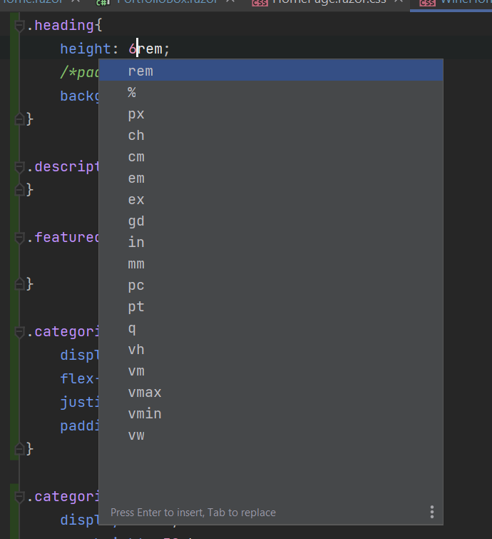

# Units of Measurement

When doing CSS styling there's normally several ways to express heights and widths of elements. For example, this is an example of the types of units available when setting a height and width.

Websites to look at:
- https://www.freecodecamp.org/news/css-unit-guide/

## rem units
Stands for “root em”, a unit of measurement that represents the font size of the **root** element. 

1rem equals the font size of the html element, which for most browsers has a default value of 16px.

[Source](https://www.sitepoint.com/understanding-and-using-rem-units-in-css/)

## percentage (%)
Used to represent the percentage height/width relative to the parent container. I like using this when defining a flex box and my child element needs to be a specific percentage height of the parente.

## px
Pixel height/width definition. Note that the number of pixels differs by device so you're completely at the mercy of the device you're working with to determine how big an element is.

## ch
Character unit. THis uses the character widtch of the character 0 as a base unit to determine sizes of elements.

## cm
A centimeter, 1cm is roughly 37.8 pixels according to [this](https://www.freecodecamp.org/news/css-unit-guide/) website.

## em
Similar to rem, but normally uses the current/target element to determine the relative heights.
- When used with the font-size property, em inherits the font-size from its parent element.
- If em is used with another property like width, em is calculated using the size of the targeted element.
- according to [this](https://www.w3schools.com/cssref/css_units.asp), it's just the font size of the target element.

## ex 
Relative to the x-height of the current font (rarely used)

## gd
Cannot find any references to this height specification 🤷‍♀️
I've asked on [Stack Overflow](https://stackoverflow.com/questions/73599104/what-is-the-definition-of-the-gd-css-unit)

## in
Inches

## mm 
Millmeters

## pc
picas (1pc = 12 pt) 

## pt 
Points - points (1pt = 1/72 of 1in)  [Source](https://www.w3schools.com/cssref/css_units.asp)

## q
Absolute length 1/40th of a cm [Source](https://stackoverflow.com/questions/63211444/what-is-q-and-in-the-css-style-of-the-html-body-tag)

## vh
View height - relative measurement given the height of the viewport.

## vm
vm : hundredths of whichever is smaller, the viewport width or height. [Source](https://www.quirksmode.org/css/viewport.html)

## vmax
 	Relative to 1% of viewport's* larger dimension

## vmin
Relative to 1% of viewport's* smaller dimension

## vw
View width - relative measurement given the width of the viewport.